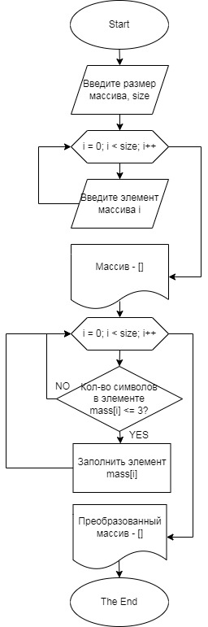

**Для решения работы необходимо:**
- Создать репозиторий на GitHub;
- Нарисовать блок-схему алгоритма;
- Добавить в репозиторий оформленное текстовое описание решения;
- Написать программу C#.

**Задача:**
- написать программу, которая из имеющегося массива строк формирует массив из строк, длина которых меньше либо равна 3 символа.

**Решение:**
- [Репозиторий](https://github.com/Mavreekee/ControlWork);
- Блок-схема будет ниже:

- Программа лежит в папке *program*.

**Описания решения:**
- Сначала пользователь указывает размер массива.
- Далее задается массив, размер которого был задан пользователем.
- Запускается цикл, в котором Пользователь поочередно вводит с клавиатуры элементы массива. И далее выводится исходный массив.
- Далее запускается метод, который проверяет количество символов каждого элемента в массиве. Если количество символов меньше или равно 3, то данный элемент запоминается, иначе данный элемент игнорируется и проверяется следующий.
- После завершения метода выводится преобразованный массив* который состоит только из элементов, у которых количество символов меньше или равно 3.